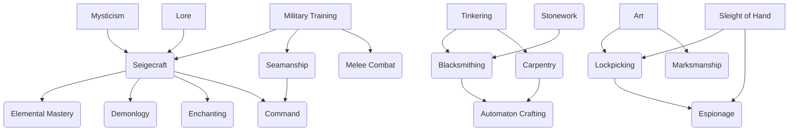

```mermaid
flowchart TD
   M["Mysticism"] --> SC("Spell Casting")
   L["Lore"] --> SC
   SC --> EM("Elemental Mastery")
   SC --> D("Demonlogy")
   SC --> En("Enchanting")
   T["Tinkering"] --> B("Blacksmithing")
   T --> C("Carpentry")
   St("Stonework") --> B
   C --> AC("Automaton Crafting")
   B --> AC
   MT["Military Training"] --> SC("Seigecraft")
   MT --> SM("Seamanship")
   MT --> MC("Melee Combat")
   SM --> CO("Command")
   SC --> CO("Command")
   A["Art"] --> LP("Lockpicking")
   SH["Sleight of Hand"] --> LP
   SH --> ES("Espionage")
   LP --> ES("Espionage")
   A --> MM("Marksmanship")
```
